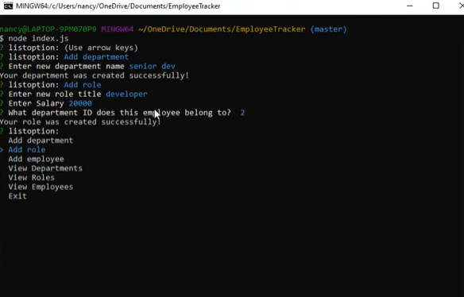

# Employee Tracker
 

## Description 
For this assignment the goal is to build a content managing system for a company so they can better manage their employees. We will be using node, inquirer, and MySQL to achieve the build.

## User Story
A business owner wants to be able to view and manage their departments, roles, and employees so that they can organize and plan accordingly.

## Acceptance Criteria
- When running index.js file with node and choices appear for user
- Given when user can add departments
- Given when user can add roles 
- Given when user can add employees
- Given when user can view department table
- Given when user can view role table
- Given when user can view employee table
- Given when user can update employee roles

## Tools and Technologies
- React
- CSS

## Usage 
 
> **To view how my application runs**: visit [Link](https://drive.google.com/file/d/1N0xXUJDnmwJfWMG5nNucWNWv8Nhce_3G/view?usp=sharing)

## Mock up
Assets\emp-Tracker.png